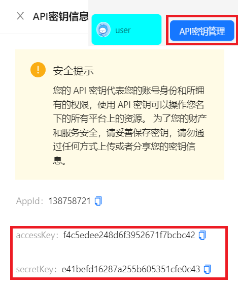

# 本站介绍

官方文档地址：[https://docs.openapi.love](https://docs.openapi.love/)

在当今快节奏的技术环境中，为了满足开发者和用户对于获取特定信息和功能的需求，OpenAPI为开发者提供了一种简单且高效的方式访问各种服务和数据，同时为用户提供了一个统一的入口来获取他们所需的信息和功能。

OpenAPI 建于2023年05月25日，使用免费(目前购买功能仅为沙箱测试)，旨在为开发者和用户提供一个便捷快速的途径，让他们能够轻松地获取所需的信息和功能。通过提供一致的接口标准和易于使用的工具，我们希望促进开发者的创造力和用户的满意度，为用户和开发者带来更多的便利和价值，从而推动系统的集成和业务的发展。通过客户端SDK，开发者可以利用提供的接口和文档，轻松地集成他们的应用程序或系统与平台上的服务进行交互。对于用户而言，OpenAPI提供了一个便捷的方式来访问他们所需的信息和功能。

目前支持两种请求方式，一种是登录主站通过网页请求，另一种面向开发者，客户端SDK调用。但不论是哪种，您都需要在主站登录开通接口调用权限。

## 主站调用

主站地址：[https://www.openapi.love](https://www.openapi.love/)

您可以通过手机号注册方式注册账号，注册后您可以使用账号密码登录或是手机验证码方式登录，若您不想注册，本站还支持GitHub和Gitee第三方授权登录。

注册登录后，在左侧导航里找到在线调用，即可浏览您想要的使用的接口，单击查看接口详情信息以及可调用次数。

每一个接口在您注册时都为您分配了 `100` 次调用次数，而后每天您都可以登录主站领取次数，每天都可以领取 `50` 次调用次数，上限为1000。

> 接口频繁调用( `120/min` )会自动拉黑 `5min`，如果**多次导致**服务器负载过高(CPU 100%)，**影响其他用户正常使用**或提交**恶意参数**将会被**永久拉黑**。

## 客户端SDK调用

#### 0、引入 sdk

> 本站客户端SDK已发布至Maven仓库

```xml
<dependency>
    <groupId>love.openapi</groupId>
    <artifactId>api-sdk</artifactId>
    <version>0.0.2</version>
</dependency>
```

#### 1、登录 [OpenAPI](https://www.openapi.love) 获取开发者密钥对

> API密钥管理位于首页左下角头像右侧



#### 2、初始化 ApiClient 对象

方法 1：自主 new 对象

```java
String accessKey = "你的 accessKey";
String secretKey = "你的 secretKey";
ApiClient apiClient = new ApiClient(accessKey,secretKey);
```

方法 2：通过配置注入对象

修改配置：

```yaml
api:
  client:
    access-key: 你的 access-key
    secret-key: 你的 secret-key
```

使用客户端对象：

```java
@Resource
private ApiClient apiClient;
```

#### 3、构造请求参数

```java
Api api = new Api();
api.setInterfaceId(1651468516836098050L);
api.setParameter("你好");
```

#### 4、调用接口

```java
BaseResponse apiClientResult = apiClient.getResult(api);
System.out.println(apiClientResult.getData());
```

#### 5、响应结果

```json
{
	"code": 0,
    "data": "你好，有什么需要帮助的吗?",
    "message": "ok"
}
```


:::tip
本站接口均来自于网络，仅供学习交流使用，如有侵权请联系站长删除！
:::